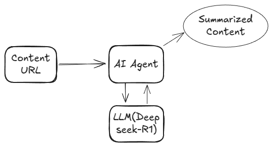

# content_translate_summary
This program is a simple AI agent program that summarizes YouTube content using AI. 
Various models can be used, and this uses DeepSeek-R1 model.



## Make environment & install packages

<pre><code># python3 -m venv venv1
# souce venv/bin/activate
# pip install -r requirements.txt
</code></pre>

## Install ollama in Ubuntu

1. check your system version (I used Ubuntu 24.04)
    <pre><code># lsb_release -a</code></pre>

2. visit ollama site and get information

    Link : https://ollama.com

3. Install 
    <pre><code># curl -fsSL https://ollama.com/install.sh | sh</code></pre>

4. check ollama version & stop and start ollama with deepseek-r1 model
    <pre><code> # ollama --verison
    # sudo systemctl stop ollama
    # sudo systemctl start ollama
    # ollama run deepseek-r1:1.5b</code></pre>

5. following commands are useful (Link : https://github.com/ollama/ollama/blob/main/docs/api.md)
    
    -  running model
    <pre><code> http://localhost:11434 </code></pre>
    -  List local models
    <pre><code> http://localhost:11434/api/tags </code></pre>
    -  post /api/show
    <pre><code> curl http://localhost:11434/api/show -d '{"name": "deepseek-r1:1.5b"}' </code></pre>
    -  Use /api/generate
    <pre><code> curl http://localhost:11434/api/generate -d '{"model": "deepseek-r1:1.5b","prompt": "Why is the sky blue?"}' </code></pre>
    -  Use /api/generate with indicating json
        ```json
        curl http://localhost:11434/api/generate -d '{
            "model": "llama3.1",
            "prompt": "What color is the sky at different times of the day? Respond using JSON",
            "format": "json",
            "stream": false
            }'


## Run translate_summary
You can enter YOUTUBE_ID what you want (https://www.youtube.com/watch?v=xxxxxxxxxx -> xxxxxxxxxx is YOUTUBE_ID)
<pre><code># python translate_summary.py </pre></code>
